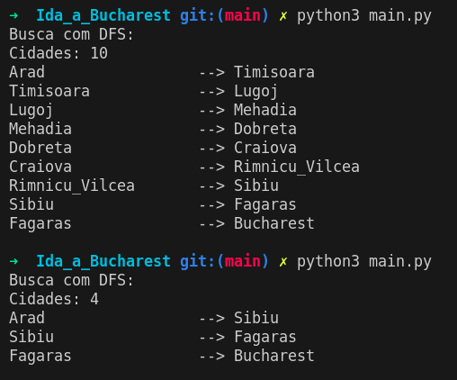

# Resultados Obtidos

## Resultado Ida a Bucharest

DFS depende da ordem que os nós são expandidos. A primeira mostra como o algoritmo percorre de maneira "sem criterio". Na verdade, foi a ordem que o Set() python gerou. A segunda execução mostra quando o algoritmo prioriza o caminho mais profundo (com maior custo).